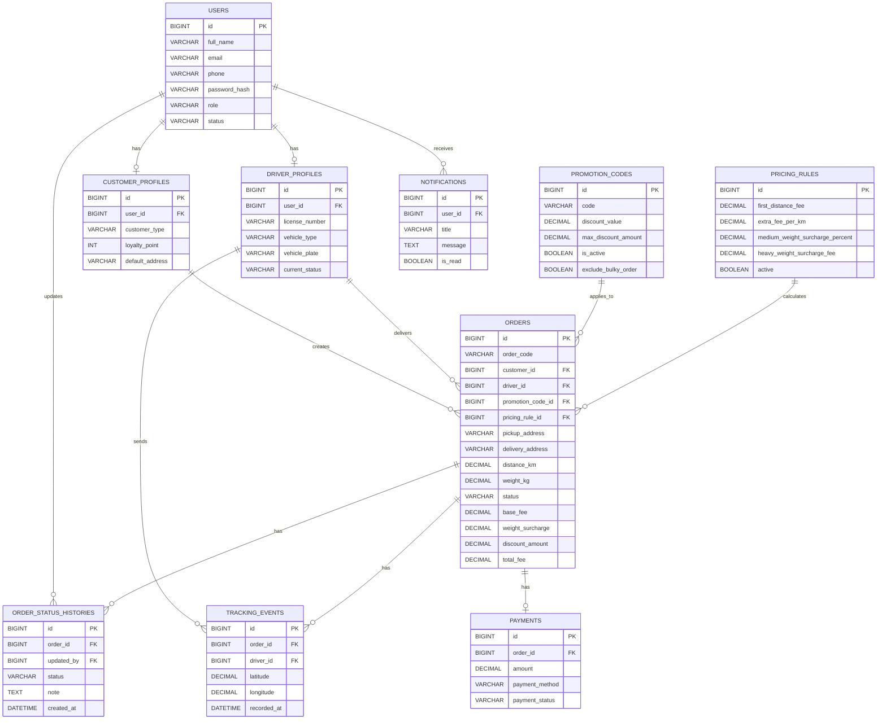

# BÁO CÁO 1: TÁI CẤU TRÚC HỆ THỐNG DỄ MỞ RỘNG

## 1. Mục tiêu kỹ thuật

Đoạn mã `OrderService.checkout()` ban đầu vi phạm **Open/Closed Principle** vì mọi logic tính tiền, voucher, thanh toán và gửi email đều nằm trong một hàm.

Khi thêm voucher mới như `NEWUSER`, `BLACKFRIDAY`, hoặc thêm phương thức thanh toán mới như `ZaloPay`, `ApplePay`, lập trình viên phải sửa trực tiếp vào `checkout()`. Điều này dễ làm hỏng logic cũ và khiến hệ thống khó bảo trì.

Mục tiêu refactor:

- Tách riêng logic voucher.
- Tách riêng logic payment.
- Tách riêng logic notification.
- Thêm tính năng mới mà không cần sửa `OrderService`.
- Dùng `BigDecimal` thay cho `double` khi tính tiền.

---

## 2. Mã nguồn ban đầu

```java
public class OrderService {
    public Order checkout(Cart cart, User user, String paymentMethod, String voucherCode) {
        if (user.getStatus() != 1) throw new RuntimeException("User locked");

        double total = 0;
        for (Item i : cart.getItems()) {
            total += i.getPrice() * i.getQuantity();
        }

        if (voucherCode != null) {
            if (voucherCode.startsWith("VIP")) total = total * 0.8;
            else if (voucherCode.startsWith("FREESHIP")) total = total - 30000;
        }

        if (paymentMethod.equals("MOMO")) {
            System.out.println("Connecting to Momo API..."); 
        } else if (paymentMethod.equals("VNPAY")) {
            System.out.println("Connecting to VNPay API..."); 
        } else {
            throw new RuntimeException("Payment not supported");
        }

        System.out.println("Sending email to " + user.getEmail() + " about order details...");
        return new Order(user, total, "SUCCESS");
    }
}
```

---

## 3. Lịch sử Prompt Chain

### Prompt vòng 1

```text
Hãy đóng vai trò là Senior Java Developer.

Tôi có đoạn code OrderService xử lý checkout đang bị viết quá nhiều if/else cho voucher, payment method và notification.

Yêu cầu:
1. Phân tích đoạn code đang vi phạm nguyên tắc thiết kế nào.
2. Đề xuất hướng refactor để dễ mở rộng.
3. Viết lại code Java theo hướng tách logic voucher, payment và notification ra khỏi OrderService.
```

### Kết quả AI vòng 1

AI đề xuất tách `OrderService` thành các service nhỏ hơn như `VoucherService`, `PaymentService` và `EmailService`.

Tuy nhiên, trong `VoucherService` và `PaymentService` vẫn còn dùng `if/else`.

### Phân tích lỗi AI vòng 1

AI chỉ chuyển `if/else` từ `OrderService` sang service khác, chưa giải quyết tận gốc vi phạm **Open/Closed Principle**. Khi thêm voucher hoặc payment mới vẫn phải sửa code cũ.

---

### Prompt vòng 2

```text
Code vòng 1 vẫn chưa đạt yêu cầu vì AI chỉ chuyển if/else sang VoucherService và PaymentService.

Hãy refactor lại theo đúng Open/Closed Principle bằng Strategy Pattern.

Yêu cầu:
1. Không được dùng if/else hoặc switch trong OrderService để phân loại voucher/payment.
2. Mỗi loại voucher là một class riêng implement VoucherStrategy.
3. Mỗi phương thức thanh toán là một class riêng implement PaymentStrategy.
4. Notification tách thành interface NotificationSender.
5. Dùng BigDecimal thay cho double khi tính tiền.
```

### Kết quả AI vòng 2

AI đề xuất cấu trúc tốt hơn:

- `VoucherStrategy`
- `VipVoucherStrategy`
- `FreeShipVoucherStrategy`
- `PaymentStrategy`
- `MomoPaymentStrategy`
- `VnPayPaymentStrategy`
- `NotificationSender`
- `EmailNotificationSender`

Hạn chế: Chưa có `VoucherResolver`, `PaymentResolver`, chưa xử lý rõ payment không hỗ trợ.

---

### Prompt vòng 3

```text
Hãy tối ưu tiếp bản refactor ở vòng 2.

Yêu cầu:
1. Thêm VoucherResolver để tìm VoucherStrategy phù hợp.
2. Thêm PaymentResolver để tìm PaymentStrategy phù hợp.
3. Nếu không có voucher phù hợp thì giữ nguyên giá.
4. Nếu payment method không hỗ trợ thì ném PaymentNotSupportedException.
5. OrderService chỉ còn nhiệm vụ điều phối luồng checkout.
6. Code phải thể hiện rõ: thêm ZaloPay hoặc ApplePay chỉ cần tạo class mới, không sửa OrderService.
```

---

## 4. Giải pháp sau refactor

Áp dụng **Strategy Pattern**:

| Thành phần | Vai trò |
|---|---|
| `VoucherStrategy` | Interface xử lý voucher |
| `PaymentStrategy` | Interface xử lý thanh toán |
| `NotificationSender` | Interface gửi thông báo |
| `VoucherResolver` | Chọn voucher phù hợp |
| `PaymentResolver` | Chọn payment phù hợp |
| `OrderService` | Điều phối quy trình checkout |

Ví dụ rút gọn:

```java
public interface VoucherStrategy {
    boolean supports(String voucherCode);
    BigDecimal apply(BigDecimal total, String voucherCode);
}

public interface PaymentStrategy {
    boolean supports(String paymentMethod);
    void pay(BigDecimal amount);
}

public interface NotificationSender {
    void send(User user, Order order);
}
```

`OrderService` sau refactor chỉ còn điều phối:

```java
public class OrderService {
    private final VoucherResolver voucherResolver;
    private final PaymentResolver paymentResolver;
    private final NotificationSender notificationSender;

    public Order checkout(Cart cart, User user, String paymentMethod, String voucherCode) {
        validateUser(user);

        BigDecimal total = calculateTotal(cart);

        VoucherStrategy voucher = voucherResolver.resolve(voucherCode);
        BigDecimal finalTotal = voucher.apply(total, voucherCode);

        PaymentStrategy payment = paymentResolver.resolve(paymentMethod);
        payment.pay(finalTotal);

        Order order = new Order(user, finalTotal, "SUCCESS");
        notificationSender.send(user, order);

        return order;
    }
}
```

## 5. Kết luận

Sau quá trình Prompt lặp, hệ thống được refactor theo hướng dễ mở rộng hơn. Code ban đầu dùng nhiều `if/else`, khó bảo trì. Code sau refactor dùng `Strategy Pattern`, giúp thêm voucher, payment hoặc notification mới mà không sửa logic cốt lõi.

Kết quả đáp ứng yêu cầu:

> Thêm voucher mới, payment method mới hoặc đổi Email sang SMS mà không cần sửa `OrderService.checkout()`.

---

# BÁO CÁO 2: KIỂM TOÁN BẢO MẬT JWT AUTHENTICATION FILTER

## 1. Mục tiêu kỹ thuật

Đoạn mã `JwtAuthenticationFilter` có nhiệm vụ đọc JWT token từ header `Authorization`, kiểm tra token và lấy username để xác thực người dùng.

Tuy nhiên, đoạn code ban đầu có nhiều vấn đề bảo mật:

- Secret key bị hard-code trong source code.
- Không xử lý lỗi JWT hết hạn, sai chữ ký hoặc sai định dạng.
- Logic parse token đặt trực tiếp trong Filter.
- Có nguy cơ trả về lỗi 500 thay vì lỗi xác thực 401.
- Chưa set `Authentication` hoàn chỉnh vào `SecurityContextHolder`.

Mục tiêu là tìm giải pháp bắt lỗi tập trung ở tầng cao nhất của ứng dụng và trả về JSON lỗi thống nhất, ví dụ:

```json
{
  "error": "AUTH_FAILED",
  "message": "Invalid or expired token"
}
```

---

## 2. Mã nguồn ban đầu

```java
package com.rikkei.security;

import io.jsonwebtoken.Jwts;
import jakarta.servlet.FilterChain;
import jakarta.servlet.ServletException;
import jakarta.servlet.http.HttpServletRequest;
import jakarta.servlet.http.HttpServletResponse;
import org.springframework.security.core.context.SecurityContextHolder;
import org.springframework.web.filter.OncePerRequestFilter;
import java.io.IOException;

public class JwtAuthenticationFilter extends OncePerRequestFilter {

private final String SECRET_KEY = "rikkei_secret_key_super_secure_do_not_share";

    @Override
    protected void doFilterInternal(HttpServletRequest request, HttpServletResponse response, FilterChain filterChain)
            throws ServletException, IOException {

        String authHeader = request.getHeader("Authorization");

        if (authHeader != null && authHeader.startsWith("Bearer ")) {
            String token = authHeader.substring(7);

            String username = Jwts.parser()
                    .setSigningKey(SECRET_KEY)
                    .parseClaimsJws(token)
                    .getBody()
                    .getSubject();

            if (username != null && SecurityContextHolder.getContext().getAuthentication() == null) {
                // Logic set Authentication vào SecurityContext (đã rút gọn)
            }
        }

        filterChain.doFilter(request, response);
    }
}
```

---

## 3. Lịch sử Prompt Chain

### Prompt vòng 1

```text
Hãy đóng vai trò là Senior Java Security Developer chuyên kiểm toán Spring Security và JWT.

Tôi có đoạn code JwtAuthenticationFilter dùng để đọc JWT token từ header Authorization.

Yêu cầu:
1. Phân tích các lỗ hổng bảo mật trong đoạn code.
2. Chỉ ra ít nhất 3 vấn đề nghiêm trọng liên quan đến JWT.
3. Giải thích vì sao mỗi vấn đề có thể gây rủi ro cho hệ thống.
4. Không refactor code ngay, chỉ review bảo mật.
```

### Kết quả AI vòng 1

AI chỉ ra các lỗi chính:

- Secret key bị hard-code.
- Không xử lý exception JWT.
- Logic JWT đặt trực tiếp trong Filter.
- Chưa set Authentication đầy đủ.

### Phân tích lỗi AI vòng 1

Vòng 1 mới chỉ phân tích lỗi, chưa đưa ra giải pháp cụ thể. Cần tiếp tục yêu cầu AI refactor và chuẩn hóa lỗi trả về.

---

### Prompt vòng 2

```text
Kết quả vòng 1 mới chỉ phân tích lỗi, chưa đưa ra giải pháp refactor cụ thể.

Hãy refactor JwtAuthenticationFilter theo hướng an toàn hơn.

Yêu cầu:
1. Không hard-code SECRET_KEY trong Filter.
2. Tách logic JWT sang JwtService.
3. JwtService chịu trách nhiệm extract username và validate token.
4. Filter chỉ lấy token, gọi JwtService và set Authentication.
5. Bắt các exception JWT như ExpiredJwtException, MalformedJwtException, SignatureException.
6. Khi token không hợp lệ, không để hệ thống trả về lỗi 500.
```

### Kết quả AI vòng 2

AI đề xuất tách thêm:

- `JwtService`
- `JwtAuthenticationFilter`
- `UserDetailsService`
- `UsernamePasswordAuthenticationToken`

Hạn chế: Nếu chỉ dùng `try-catch` đơn thuần trong Filter, lỗi vẫn bị xử lý rải rác và khó thống nhất JSON response.

---

### Prompt vòng 3

```text
Hãy tối ưu tiếp bản refactor ở vòng 2.

Yêu cầu:
1. Tạo AuthenticationEntryPoint để xử lý lỗi xác thực tập trung.
2. Mọi lỗi xác thực phải trả về JSON thống nhất.
3. Filter không tự viết response lỗi thủ công.
4. Khi token sai, clear SecurityContextHolder.
5. Dùng JwtService để validate token.
6. Dùng UserDetailsService để load user.
7. Giải thích tại sao không nên chỉ try-catch đơn thuần trong Filter.
```

---

## 4. Giải pháp đề xuất

### 4.1. Tách `JwtService`

`JwtService` chịu trách nhiệm parse token, lấy username và kiểm tra token.

```java
@Service
public class JwtService {

    @Value("${app.jwt.secret}")
    private String secretKey;

    public String extractUsername(String token) {
        return Jwts.parserBuilder()
                .setSigningKey(secretKey.getBytes())
                .build()
                .parseClaimsJws(token)
                .getBody()
                .getSubject();
    }

    public boolean isTokenValid(String token, UserDetails userDetails) {
        String username = extractUsername(token);
        return username.equals(userDetails.getUsername());
    }
}
```

---

### 4.2. Refactor `JwtAuthenticationFilter`

Filter chỉ lấy token, gọi service và set Authentication.

```java
@Component
public class JwtAuthenticationFilter extends OncePerRequestFilter {

    private final JwtService jwtService;
    private final UserDetailsService userDetailsService;

    public JwtAuthenticationFilter(JwtService jwtService, UserDetailsService userDetailsService) {
        this.jwtService = jwtService;
        this.userDetailsService = userDetailsService;
    }

    @Override
    protected void doFilterInternal(HttpServletRequest request,
                                    HttpServletResponse response,
                                    FilterChain filterChain)
            throws ServletException, IOException {
        try {
            String authHeader = request.getHeader("Authorization");

            if (authHeader == null || !authHeader.startsWith("Bearer ")) {
                filterChain.doFilter(request, response);
                return;
            }

            String token = authHeader.substring(7);
            String username = jwtService.extractUsername(token);

            if (username != null && SecurityContextHolder.getContext().getAuthentication() == null) {
                UserDetails userDetails = userDetailsService.loadUserByUsername(username);

                if (jwtService.isTokenValid(token, userDetails)) {
                    UsernamePasswordAuthenticationToken authentication =
                            new UsernamePasswordAuthenticationToken(
                                    userDetails,
                                    null,
                                    userDetails.getAuthorities()
                            );

                    SecurityContextHolder.getContext().setAuthentication(authentication);
                }
            }
        } catch (Exception ex) {
            SecurityContextHolder.clearContext();
        }

        filterChain.doFilter(request, response);
    }
}
```

---

### 4.3. Xử lý lỗi xác thực tập trung bằng `AuthenticationEntryPoint`

```java
@Component
public class CustomAuthenticationEntryPoint implements AuthenticationEntryPoint {

    @Override
    public void commence(HttpServletRequest request,
                         HttpServletResponse response,
                         AuthenticationException authException)
            throws IOException {

        response.setStatus(HttpServletResponse.SC_UNAUTHORIZED);
        response.setContentType("application/json;charset=UTF-8");

        response.getWriter().write("""
        {
          "error": "AUTH_FAILED",
          "message": "Invalid or expired token"
        }
        """);
    }
}
```

---

## 5. Vì sao không nên chỉ dùng try-catch trong Filter?

Không nên chỉ dùng `try-catch` đơn thuần trong Filter vì:

- Logic xử lý lỗi bị rải rác trong nhiều filter.
- Khó đảm bảo tất cả lỗi xác thực trả về cùng một format JSON.
- Dễ quên `clear SecurityContextHolder`.
- Khó mở rộng khi cần thêm error code, traceId hoặc timestamp.
- Không tận dụng đúng cơ chế xử lý lỗi của Spring Security.

Giải pháp tốt hơn là để Filter phát hiện lỗi, clear context, sau đó dùng `AuthenticationEntryPoint` để chuẩn hóa response.

---

## 6. Đánh giá kết quả

| Tiêu chí | Code ban đầu | Code sau refactor |
|---|---|---|
| Secret key | Hard-code trong Filter | Đọc từ cấu hình |
| Logic JWT | Đặt trực tiếp trong Filter | Tách sang `JwtService` |
| Lỗi JWT | Dễ gây 500 | Trả JSON lỗi thống nhất |
| Authentication | Chưa hoàn chỉnh | Set bằng `UsernamePasswordAuthenticationToken` |
| Xử lý lỗi | Rải rác hoặc thiếu | Tập trung qua `AuthenticationEntryPoint` |
| Bảo trì | Khó | Dễ hơn |

---

## 7. Kết luận

Sau quá trình Prompt lặp, đoạn mã `JwtAuthenticationFilter` được cải thiện theo hướng an toàn và dễ bảo trì hơn.

Giải pháp cuối cùng:

- Không hard-code secret key.
- Tách logic JWT sang `JwtService`.
- Filter chỉ điều phối luồng xác thực.
- Lỗi xác thực trả về JSON thống nhất.
- Không phụ thuộc vào `try-catch` đơn thuần trong Filter.

Kết quả đáp ứng yêu cầu:

> Mọi lỗi xác thực liên quan đến JWT đều được xử lý tập trung và trả về format JSON thống nhất.

# PHẦN 3: PHÂN TÍCH VÀ THIẾT KẾ HỆ THỐNG VỚI AI

## Dự án: Rikkei Logistics

---

## 1. Bối cảnh dự án

Một startup giao hàng siêu tốc cần xây dựng nền tảng công nghệ toàn diện có tên **Rikkei Logistics**.

Hệ thống bao gồm:

- Ứng dụng Mobile dành cho khách hàng và tài xế.
- Hệ thống Web Admin dành cho nhân viên điều phối và quản trị viên.
- Hệ thống cần hỗ trợ quản lý người dùng, tính phí giao hàng phức tạp và theo dõi đơn hàng theo thời gian thực.

Các nghiệp vụ cốt lõi:

1. Quản lý người dùng:
   - Khách hàng thường
   - Khách hàng VIP
   - Tài xế
   - Quản trị viên

2. Tính phí giao hàng:
   - 5km đầu tiên: 40.000 VNĐ
   - Từ km thứ 6 trở đi: cộng thêm 5.000 VNĐ/km
   - Dưới 10kg: miễn phí phụ phí trọng lượng
   - Từ 10kg đến 30kg: phụ phí 20% trên phí quãng đường
   - Trên 30kg: phụ phí cố định 100.000 VNĐ
   - Khách VIP miễn 100% phí quãng đường nhưng vẫn chịu phụ phí trọng lượng nếu có
   - Mã giảm giá ví dụ `FREESHIP50` giảm tối đa 50.000 VNĐ trên tổng tiền cuối cùng
   - Mã giảm giá không áp dụng cho hàng cồng kềnh trên 30kg

3. Theo dõi đơn hàng:
   - Trạng thái đơn hàng cần được cập nhật real-time trên app của khách hàng.

---

# NHIỆM VỤ 1: ĐỀ XUẤT GIẢI PHÁP CÔNG NGHỆ

## 1.1. Prompt yêu cầu AI đề xuất Tech Stack

```text
Bạn hãy đóng vai trò là một Solution Architect có kinh nghiệm thiết kế hệ thống logistics quy mô startup.

Bối cảnh:
Tôi cần xây dựng nền tảng "Rikkei Logistics" gồm:
- Mobile app cho khách hàng và tài xế.
- Web Admin cho nhân viên điều phối và quản trị viên.
- Hệ thống quản lý người dùng gồm khách hàng thường, khách hàng VIP, tài xế và quản trị viên.
- Hệ thống tính phí giao hàng phức tạp theo quãng đường, trọng lượng, VIP và mã giảm giá.
- Hệ thống theo dõi trạng thái đơn hàng real-time trên app khách hàng.

Yêu cầu:
Hãy đề xuất một bộ Tech Stack phù hợp cho dự án gồm:
1. Frontend Mobile
2. Web Admin
3. Backend API
4. Database
5. Real-time tracking
6. Authentication & Authorization
7. Deployment / Hosting
8. Công cụ quản lý source code và CI/CD

Với mỗi lựa chọn, hãy giải thích:
- Vì sao phù hợp với startup
- Ưu điểm
- Hạn chế nếu có
- Lý do có thể thuyết phục khách hàng lựa chọn

```

---

## 1.2. Tóm tắt Tech Stack đề xuất

| Thành phần | Công nghệ đề xuất | Lý do |
|---|---|---|
| Mobile App | Flutter | Một codebase cho Android/iOS, tiết kiệm chi phí startup |
| Web Admin | ReactJS | Phù hợp làm dashboard quản trị, dễ mở rộng |
| Backend API | Spring Boot | Mạnh về xử lý nghiệp vụ, bảo mật, phân quyền |
| Database | PostgreSQL | Phù hợp dữ liệu quan hệ, transaction tốt |
| Real-time | WebSocket | Cập nhật trạng thái đơn hàng tức thời |
| Cache / PubSub | Redis | Hỗ trợ mở rộng real-time khi nhiều server |
| Auth | JWT + Role-based Authorization | Phù hợp Mobile/Web, dễ phân quyền |
| Deployment | Docker + VPS/Cloud | Dễ triển khai, dễ mở rộng |
| CI/CD | GitHub Actions | Tự động test và deploy |

---

## 1.3. Nhận xét phản biện

Tôi đồng ý với Tech Stack trên vì phù hợp với startup, vừa tiết kiệm chi phí vừa đáp ứng nghiệp vụ phức tạp.

Đặc biệt:

- **Spring Boot** phù hợp xử lý logic tính phí giao hàng.
- **Flutter** giúp giảm chi phí phát triển Mobile App.
- **ReactJS** phù hợp xây dựng Web Admin.
- **PostgreSQL** phù hợp với dữ liệu có nhiều quan hệ.
- **WebSocket** đáp ứng yêu cầu tracking real-time.

Tuy nhiên, không nên triển khai Microservices hoặc Kubernetes ngay từ đầu vì startup chưa cần độ phức tạp lớn. Giai đoạn đầu nên dùng mô hình **Modular Monolith**, sau đó mới mở rộng nếu hệ thống tăng trưởng.

---

# NHIỆM VỤ 2: PHÂN TÍCH THỰC THỂ

## 2.1. Prompt sử dụng

```text
Bạn hãy đóng vai trò là System Analyst.

Bối cảnh:
Hệ thống Rikkei Logistics có Mobile App, Web Admin, nhiều vai trò người dùng, nghiệp vụ tạo đơn giao hàng, tính phí, gán tài xế và tracking real-time.

Yêu cầu:
Hãy phân tích các thực thể cốt lõi cần có trong database.
Với mỗi entity, hãy nêu:
1. Tên entity
2. Vai trò
3. Thuộc tính quan trọng
4. Quan hệ với entity khác
```

---

## 2.2. Danh sách Entity cốt lõi

| Entity | Vai trò | Thuộc tính chính |
|---|---|---|
| User | Lưu tài khoản đăng nhập | id, fullName, email, phone, passwordHash, role, status |
| CustomerProfile | Lưu thông tin khách hàng | id, userId, customerType, loyaltyPoint, defaultAddress |
| DriverProfile | Lưu thông tin tài xế | id, userId, licenseNumber, vehicleType, vehiclePlate, currentStatus |
| Order | Lưu thông tin đơn giao hàng | id, orderCode, customerId, driverId, distanceKm, weightKg, status, totalFee |
| OrderStatusHistory | Lưu lịch sử trạng thái đơn | id, orderId, status, note, updatedBy, createdAt |
| PromotionCode | Lưu mã giảm giá | id, code, discountValue, maxDiscountAmount, isActive |
| Payment | Lưu thanh toán | id, orderId, amount, paymentMethod, paymentStatus |
| TrackingEvent | Lưu dữ liệu tracking | id, orderId, driverId, latitude, longitude, recordedAt |
| Notification | Lưu thông báo | id, userId, title, message, isRead |
| PricingRule | Lưu quy tắc tính phí | id, firstDistanceFee, extraFeePerKm, weightSurchargeRule |

---

## 2.3. Quan hệ chính

- Một `User` có thể là khách hàng hoặc tài xế.
- Một `CustomerProfile` có nhiều `Order`.
- Một `DriverProfile` có thể được gán nhiều `Order`.
- Một `Order` có nhiều `OrderStatusHistory`.
- Một `Order` có nhiều `TrackingEvent`.
- Một `Order` có thể áp dụng một `PromotionCode`.
- Một `Order` có một `Payment`.
- Một `User` có nhiều `Notification`.
- `PricingRule` được dùng để tính phí cho `Order`.

---

# NHIỆM VỤ 3: THIẾT KẾ ERD

## 3.1. Prompt sử dụng

```text
Bạn hãy đóng vai trò là Database Designer.

Dựa trên các entity đã chốt:
User, CustomerProfile, DriverProfile, Order, OrderStatusHistory, PromotionCode, Payment, TrackingEvent, Notification, PricingRule.

Yêu cầu:
Hãy tạo sơ đồ ERD bằng Mermaid.
Sơ đồ cần có:
- Tên bảng
- Khóa chính PK
- Khóa ngoại FK
- Thuộc tính quan trọng
- Quan hệ giữa các bảng
```

---

## 3.2. Mã Mermaid ERD

